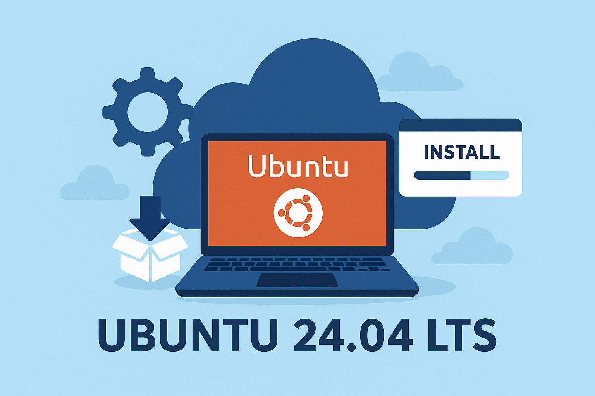

# Deploy Python Apps Without the Cloud Complexity: A Practical Ubuntu Server Guide



**Part 1 of 3: Base System Setup**

## Series Overview

This is the first article in a three-part series on deploying production-ready applications on Ubuntu Server 24.04 LTS:

- **Part 1: Ubuntu Installation and Base Setup** (this article) - Deploy and configure a secure Ubuntu Server foundation
- **Part 2: Docker and Container Management** (coming soon) - Set up Docker for containerized application deployment
- **Part 3: CI/CD for Python Applications** (coming soon) - Automate testing and deployment with modern CI/CD pipelines

## Introduction

Ubuntu Server 24.04 LTS (Noble Numbat) has become the gold standard for cloud Virtual Private Server (VPS) deployments. Whether you're deploying a personal project, launching a startup, or managing production infrastructure, Ubuntu LTS releases provide the reliability, security, and ecosystem support needed for modern applications.

This guide focuses on deploying a rock-solid Ubuntu Server 24.04 LTS foundation on cloud VPS providers—specifically DigitalOcean, Linode, and Hetzner. We'll leverage automated configuration scripts to ensure consistency, security, and developer productivity from day one.

By the end of this guide, you'll have a secure, optimized Ubuntu server ready for containerized applications (covered in Part 2) and automated deployments (covered in Part 3).

### Acknowledgments

This guide is inspired by the practical insights from Michael Kennedy's excellent book [**Talk Python in Production**](https://talkpython.fm/books/python-in-production). His real-world experience running TalkPython and the philosophy that **big, complex cloud infrastructure isn't necessary for every project** has been invaluable. You don't need Kubernetes clusters and complex managed services to build reliable, production-ready applications—a well-configured Ubuntu VPS can be powerful, cost-effective, and much simpler to manage. Thank you, Michael, for sharing these insights with the developer community!

## Why Choose Ubuntu for Your Cloud VPS?

### Market Leadership and Proven Track Record

Ubuntu Server dominates the cloud landscape for good reasons:

- **Market Share Leader** - Ubuntu powers over 40% of cloud instances worldwide
- **Default Choice** - Most cloud providers list Ubuntu as their recommended Linux distribution
- **Battle-Tested** - Over 20 years of Canonical's development and refinement since 2004
- **Production Proven** - Powers infrastructure at organizations from startups to Fortune 500 companies

### Long Term Support (LTS) Advantages

The LTS release model provides critical benefits for server deployments:

- **Extended Security Updates** - 5 years of free security patches and critical bug fixes (until April 2029)
- **Predictable Release Cycle** - New LTS versions every 2 years (April of even-numbered years)
- **Upgrade Path** - Well-documented upgrade procedures between LTS releases
- **Production Stability** - Packages are thoroughly tested and optimized for reliability over bleeding-edge features
- **Extended Support Options** - Ubuntu Pro extends support to 10 years for compliance-critical environments

### Superior Documentation and Community Support

One of Ubuntu's strongest advantages is its ecosystem:

- **Comprehensive Documentation** - Official guides cover nearly every use case
- **Massive Community** - Largest Linux community means answers are readily available
- **Stack Overflow Presence** - More questions and answers than any other server distribution
- **Tutorial Abundance** - Third-party guides and tutorials for virtually any stack or application
- **Active Forums** - AskUbuntu and official forums provide quick community assistance

### Cloud-Native Optimization

Ubuntu Server is specifically optimized for cloud environments:

- **Cloud-Init Integration** - Industry-standard tool for instance initialization and configuration
- **Minimal Cloud Images** - Streamlined images designed specifically for cloud deployment
- **Fast Boot Times** - Optimized for rapid scaling and instance startup
- **Official Images** - Canonical maintains official images for all major cloud providers
- **Container-Friendly** - Excellent Docker, Kubernetes, and LXD support out of the box (we'll leverage Docker in Part 2)

### Developer-Friendly Environment

Ubuntu Server excels as a development and deployment platform:

- **Modern Tooling** - Latest versions of Python, Node.js, Go, and other languages readily available
- **Wide Software Support** - Most server software provides Ubuntu as tier-1 supported platform
- **Localhost-Production Parity** - Easy to match cloud server environment locally with Ubuntu Desktop or WSL
- **Scripting and Automation** - Bash and Python pre-installed; excellent Ansible and Terraform support
- **CI/CD Integration** - Default choice for GitHub Actions, GitLab CI, and other platforms (covered in Part 3)

### Security-First Design

Security is built into Ubuntu Server's foundation:

- **Regular Security Updates** - Timely patches for vulnerabilities, often same-day for critical issues
- **Unattended Upgrades** - Automatic security update capability built-in
- **AppArmor by Default** - Mandatory access control active for key services
- **Security Hardening** - CIS and DISA STIG benchmarks available
- **Active Security Team** - Canonical's dedicated security team provides rapid CVE responses

### Cost Effectiveness

Ubuntu Server provides exceptional value:

- **Zero Licensing Costs** - Completely free for unlimited commercial and personal use
- **Lower Support Costs** - Extensive documentation reduces support burden
- **Efficient Resource Usage** - Run more workloads on less infrastructure
- **Update Automation** - Reduces manual maintenance overhead
- **Community Solutions** - Most problems already solved and documented online

### Why Ubuntu Over Other Distributions?

While distributions like Debian, CentOS/Rocky Linux, and Alpine have their merits, Ubuntu offers unique advantages for our use case:

- **More Frequent Updates** - Newer package versions than Debian Stable
- **Better Cloud Integration** - Superior cloud-init and cloud-provider tooling
- **Larger Community** - More readily available solutions and tutorials
- **Easier Learning Curve** - More beginner-friendly than minimal distributions
- **Commercial Backing** - Canonical's support provides accountability
- **Consistent Experience** - Identical environment across local development and production servers
- **Docker Optimization** - Excellent container support (critical for Part 2 of this series)

---

## Choosing Your Cloud Provider

For this series, we focus on three developer-friendly cloud providers that offer excellent value, simplicity, and performance without the complexity of enterprise cloud platforms.

### DigitalOcean

**Best for:** Developers, startups, and straightforward deployments

- **Pricing:** Starting at $4-6/month for 1GB RAM instances
- **Free Tier:** $200 credit for new accounts (typically 60 days)
- **Strengths:**
  - Extremely simple, intuitive interface
  - Excellent documentation and tutorials
  - Fast SSD-only storage
  - Predictable, transparent pricing
  - One-click applications and automated backups
  - Strong community resources
- **Data Centers:** 15+ global locations
- **Why Choose DO:** If you want simplicity and excellent documentation, DigitalOcean is hard to beat

### Linode (Akamai)

**Best for:** Performance-focused deployments with global reach

- **Pricing:** Starting at $5/month for 1GB RAM instances
- **Free Tier:** $100 credit for new accounts
- **Strengths:**
  - Excellent price-to-performance ratio
  - High-performance network backbone (Akamai acquisition)
  - Transparent, consistent pricing
  - 24/7 human support
  - Generous bandwidth allocations
  - Strong focus on infrastructure reliability
- **Data Centers:** 25+ global locations
- **Why Choose Linode:** If you prioritize performance and global presence, Linode delivers exceptional value

### Hetzner Cloud

**Best for:** Cost-conscious deployments, especially for US and European audiences

- **Pricing:** Starting at $4.09/month for 2GB RAM instances (best value)
- **Strengths:**
  - Exceptional price-to-performance ratio
  - Higher specs for lower prices
  - Excellent network infrastructure
  - Strong European data center presence
  - Environmentally conscious (green energy)
  - Simple, clean interface
- **Data Centers:** US (Ashburn, Hillsboro) and European locations (Germany, Finland)
- **Why Choose Hetzner:** If cost efficiency is your priority, Hetzner offers the best value in the market

### Quick Comparison

| Provider | Starting Price | RAM/CPU | Storage | Transfer | Free Credit | Best For |
|----------|---------------|---------|---------|----------|-------------|----------|
| DigitalOcean | $4-6/mo | 1GB / 1 vCPU | 25GB SSD | 1TB | $200 | Simplicity |
| Linode | $5/mo | 1GB / 1 vCPU | 25GB SSD | 1TB | $100 | Performance |
| Hetzner | $4.09/mo | 2GB / 1 vCPU | 20GB SSD | 20TB |  | Value |

*Prices as of October 2025. Always check current pricing.*

### Our Recommendation

For this tutorial series, any of these three providers will work perfectly. If you're just starting:

- **Choose DigitalOcean** if you're new to VPS and want the easiest experience
- **Choose Linode** if you need global data centers and premium performance
- **Choose Hetzner** if you want maximum value and higher specs for your budget

All three offer Ubuntu Server 24.04 LTS as a one-click deployment option and support the configurations we'll use throughout this series.

---

## Deploying Your VPS

### Step 1: Create Your VPS Instance

The exact process varies slightly by provider, but generally involves:

1. **Sign up and log into your provider's dashboard**
   - DigitalOcean: cloud.digitalocean.com
   - Linode: cloud.linode.com
   - Hetzner: console.hetzner.cloud

2. **Create a new instance**
   - DigitalOcean: "Create" → "Droplets"
   - Linode: "Create" → "Linode"
   - Hetzner: "New Project" → "Add Server"

3. **Select Ubuntu Server 24.04 LTS**
   - Look for "Ubuntu 24.04 LTS" in the operating system options
   - Ensure it's the LTS version (not interim releases)

4. **Choose your server size**
   - **For development/testing:** 1-2GB RAM is sufficient
   - **For production applications:** Start with 2-4GB RAM
   - **For this tutorial:** 1-2GB is perfect (you can always upgrade later)

5. **Select a region/data center**
   - Choose a location closest to your users
   - For US: NYC, San Francisco, or Ashburn
   - For Europe: Frankfurt, London, or Helsinki
   - Lower latency = better user experience

6. **Configure SSH authentication** (IMPORTANT)
   - **Recommended method:** Upload your SSH public key during creation
   - **Alternative:** Use password authentication (we'll disable this after setup)
   - If you don't have SSH keys yet, we'll create them in the next section

7. **Optional configurations**
   - Enable automated backups (recommended for production)
   - Add monitoring/alerts
   - Configure private networking (if needed)

8. **Deploy the instance**
   - Click "Create" and wait 30-60 seconds for provisioning

### Step 2: SSH Key Setup (If Needed)

If you don't have SSH keys yet, create them on your local machine:

**On Linux/Mac:**

```bash
ssh-keygen -t rsa -b 4096 -C "your_email@example.com"
# Press Enter to accept default location (~/.ssh/id_rsa)
# Set a passphrase (recommended) or press Enter for no passphrase

# Display your public key
cat ~/.ssh/id_rsa.pub
```

**On Windows (PowerShell):**

```powershell
ssh-keygen -t rsa -b 4096 -C "your_email@example.com"
# Press Enter to accept default location
# Set a passphrase or press Enter

# Display your public key
type $env:USERPROFILE\.ssh\id_rsa.pub
```

Copy the entire public key output and add it to your VPS during creation or afterward through the provider's dashboard.

### Step 3: Initial Connection

Once your VPS is deployed, you'll receive an IP address. Connect via SSH:

```bash
ssh root@your-server-ip
```

Or if you created a non-root user during deployment:

```bash
ssh yourusername@your-server-ip
```

**First time connecting?** You'll see a message about host authenticity. Type `yes` to continue.

If you set up SSH keys correctly, you should connect without a password prompt (or with your key passphrase if you set one).

---

## Initial System Configuration

### Update System Packages

**Always** start with a full system update. This ensures you have the latest security patches:

```bash
sudo apt update && sudo apt upgrade -y && sudo apt autoremove -y
```

This command does three things:
- `apt update` - Refreshes the package list
- `apt upgrade -y` - Installs all available updates
- `apt autoremove -y` - Removes unnecessary packages

Reboot to apply kernel and system updates:

```bash
sudo shutdown now -r
```

**Wait 30-60 seconds**, then reconnect via SSH.

---

## Security Hardening

Security should be your top priority before installing any applications. Let's lock down the server.

### Create an Administrative User

**Note:** Many cloud providers create a default admin user automatically:
- DigitalOcean: Uses `root` by default
- Linode: Uses `root` by default
- Hetzner: Can choose username during setup

If you're logged in as `root`, create a dedicated admin account:

```bash
# Replace 'yourusername' with your desired username
adduser yourusername
```

You'll be prompted to:
- Set a password (use a strong one!)
- Enter optional user information (you can press Enter to skip)

Add the user to the sudo group for administrative privileges:

```bash
usermod -aG sudo yourusername
```

Switch to your new user to test:

```bash
su yourusername
```

Verify sudo access works:

```bash
sudo cat /var/log/auth.log
```

If you see the log contents, sudo is working correctly.

### Configure SSH Key Authentication

SSH keys are **significantly** more secure than password authentication and are essential for automated deployments (which we'll cover in Part 3).

**If you didn't add SSH keys during VPS creation**, set them up now:

```bash
# Make sure you're logged in as your new user (not root)
cd ~
mkdir -p ~/.ssh
chmod 700 ~/.ssh
```

**Create and edit the authorized keys file:**

```bash
nano ~/.ssh/authorized_keys
```

Paste your public SSH key (the one that starts with `ssh-rsa` or `ssh-ed25519`), then save:
- Press `Ctrl+O` to save
- Press `Enter` to confirm
- Press `Ctrl+X` to exit

Set correct permissions:

```bash
chmod 644 ~/.ssh/authorized_keys
```

**Test SSH key authentication BEFORE proceeding:**

Open a new terminal window (keep your current session open!) and try connecting:

```bash
ssh yourusername@your-server-ip
```

**Important:** Don't close your original SSH session until you confirm the new connection works!

### Disable Root Login

**Critical:** Only perform this step after confirming SSH key authentication works with your regular user account.

Edit the SSH daemon configuration:

```bash
sudo nano /etc/ssh/sshd_config
```

Find this line (use `Ctrl+W` to search):

```bash
PermitRootLogin yes
```

Change it to:

```bash
PermitRootLogin no
```

While you're here, also ensure these settings are configured:

```bash
PasswordAuthentication no
PubkeyAuthentication yes
```

Save and exit (`Ctrl+O`, `Enter`, `Ctrl+X`).

Restart SSH to apply changes:

```bash
sudo systemctl restart ssh
```

**Test immediately:** Open a new terminal and verify you can still connect:

```bash
ssh yourusername@your-server-ip
```

---

## Configure the Firewall

Ubuntu Server includes UFW (Uncomplicated Firewall), which makes firewall management straightforward.

### Enable UFW

**Check current firewall status:**

```bash
sudo ufw status
```

**CRITICAL: Allow SSH BEFORE enabling the firewall:**

```bash
sudo ufw allow 22/tcp
```

If you changed the SSH port earlier, allow that port instead:

```bash
sudo ufw allow your-custom-port/tcp
```

**Enable the firewall:**

```bash
sudo ufw enable
```

Type `y` when prompted.

**Verify it's active:**

```bash
sudo ufw status verbose
```

You should see:

```
Status: active
To                         Action      From
--                         ------      ----
22/tcp                     ALLOW       Anywhere
```

### Configure Ports for Your Applications

We'll add more firewall rules as we progress through the series:

**For web applications (we'll use these in Parts 2 and 3):**

```bash
# HTTP
sudo ufw allow 80/tcp

# HTTPS
sudo ufw allow 443/tcp
```

**For custom application ports:**

```bash
sudo ufw allow 8080/tcp
```

**View all active rules:**

```bash
sudo ufw status numbered
```

**To delete a rule by number:**

```bash
sudo ufw delete [number]
```

---

## Automated Configuration Setup

Now that your server is secure, let's set up an optimized development environment using automated scripts from the [ubuntu-server-configuration](https://github.com/orue/ubuntu-server-configuration) repository.

### Install Latest Git

Ubuntu's default repositories sometimes lag behind. Install the latest Git from the official PPA:

```bash
curl -fsSL https://raw.githubusercontent.com/orue/ubuntu-server-configuration/main/install-git.sh | sudo bash
```

This script will:
- Add the official Git PPA repository
- Install the latest stable Git version
- Verify the installation

Verify the installation:

```bash
git --version
```

You should see Git 2.40 or newer.

### Install Custom Dotfiles

Deploy optimized configurations for Bash, Vim, and Git:

```bash
curl -sSL https://raw.githubusercontent.com/orue/ubuntu-server-configuration/main/dotfiles.sh | bash
```

This automated script installs:
- **`.bashrc`** - Custom aliases, functions, and enhanced prompt for productivity
- **`.vimrc`** - Optimized Vim editor configuration
- **`.gitconfig`** - Git aliases and workflow improvements (essential for Part 3)

Your existing files are automatically backed up before installation (saved as `.bashrc.backup`, `.vimrc.backup`, etc.).

### Customize Git Configuration

Set your Git identity (required for commits):

```bash
git config --global user.name "Your Name"
git config --global user.email "you@example.com"
```

Verify your Git configuration:

```bash
git config --list
```

### What Do the Dotfiles Include?

The custom dotfiles provide developer-friendly enhancements:

**Bash Aliases** (see full reference: [bashrc-aliases-reference.md](https://github.com/orue/ubuntu-server-configuration/blob/main/bashrc-aliases-reference.md)):
- `ll` - Enhanced directory listing with colors
- `la` - Show all files including hidden
- `..` and `...` - Quick directory navigation
- Git shortcuts like `gs`, `ga`, `gc`
- System monitoring aliases

**Vim Configuration** (see full reference: [vim-keymapping-cheatsheet.md](https://github.com/orue/ubuntu-server-configuration/blob/main/vim-keymapping-cheatsheet.md)):
- Syntax highlighting enabled
- Line numbers and ruler
- Smart indentation
- Better search settings
- Custom keybindings for efficiency

**Git Configuration**:
- Useful aliases for common operations
- Better diff and merge tools
- Colored output
- Helpful defaults for modern workflows

### Apply Configuration Changes

Reload your bash configuration:

```bash
source ~/.bashrc
```

Or simply disconnect and reconnect to see the changes.

---

## Enable Automatic Security Updates

Keep your server secure with automated security updates:

```bash
sudo apt install unattended-upgrades -y
```

**Note:** This package is usually pre-installed on Ubuntu, but this ensures it's available.

Enable the service:

```bash
sudo dpkg-reconfigure --priority=low unattended-upgrades
```

Select "Yes" when prompted to enable automatic updates.

This configuration:
- Automatically installs security updates
- Requires manual approval for feature updates
- Reduces the risk of running unpatched software
- Balances security with stability

### Verify Unattended Upgrades Configuration

Check the status:

```bash
sudo systemctl status unattended-upgrades
```

View the configuration:

```bash
cat /etc/apt/apt.conf.d/50unattended-upgrades
```

---

## Verify Your Configuration

After all setup steps, verify everything is working correctly:

```bash
# Check Git version
git --version

# Test custom aliases
ll  # Should show colorized directory listing

# Check automatic updates status
sudo systemctl status unattended-upgrades

# Verify firewall is active
sudo ufw status

# Check system resources
df -h  # Disk space
free -h  # Memory usage

# View system information
uname -a
lsb_release -a
```

---

## Essential Monitoring Commands

Now that your server is configured, familiarize yourself with these essential monitoring commands:

### System Resources

```bash
# Install htop for better resource monitoring
sudo apt install htop -y

# Interactive process viewer
htop

# Check disk usage
df -h

# Check directory sizes
du -sh /var/log/*

# Check memory usage
free -h

# View system uptime and load
uptime

# View running processes
ps aux | head -20

# Find processes by name
ps aux | grep nginx
```

### System Logs

```bash
# View recent system events
sudo journalctl -xe

# Follow authentication logs (useful for monitoring SSH attempts)
sudo tail -f /var/log/auth.log

# Check for errors in current boot
sudo journalctl -p err -b

# View kernel messages
dmesg | tail -50
```

### Service Management

```bash
# Check SSH service status
sudo systemctl status ssh

# View all running services
sudo systemctl list-units --type=service --state=running

# View all failed services
sudo systemctl --failed

# Restart a service
sudo systemctl restart [service-name]

# Enable service to start on boot
sudo systemctl enable [service-name]
```

### Network Monitoring

```bash
# List all listening ports
sudo netstat -tlnp

# Or using ss (modern alternative)
sudo ss -tlnp

# Check active network connections
sudo netstat -an | grep ESTABLISHED

# View firewall rules
sudo ufw status numbered

# Test connectivity
ping -c 4 google.com
```

---

## Troubleshooting Common Issues

### Cannot Connect via SSH

**Check if SSH is running:**

```bash
sudo systemctl status ssh
sudo systemctl restart ssh
```

**Verify SSH port is open in firewall:**

```bash
sudo ufw status
sudo netstat -tlnp | grep :22
```

**Check SSH configuration:**

```bash
sudo cat /etc/ssh/sshd_config | grep -E "PermitRootLogin|PasswordAuthentication|Port"
```

**View SSH logs for connection attempts:**

```bash
sudo tail -50 /var/log/auth.log
```

### SSH Key Authentication Fails

**Check file permissions (very important!):**

```bash
ls -la ~/.ssh/
```

Correct permissions should be:
- `.ssh` directory: `drwx------` (700)
- `authorized_keys`: `-rw-r--r--` (644)
- Private keys: `-rw-------` (600)

**Fix permissions if needed:**

```bash
chmod 700 ~/.ssh
chmod 644 ~/.ssh/authorized_keys
```

**Verify key is in authorized_keys:**

```bash
cat ~/.ssh/authorized_keys
```

### Locked Out After Configuration Changes

If you accidentally lock yourself out:

1. **Use your cloud provider's web console:**
   - DigitalOcean: "Access" → "Launch Droplet Console"
   - Linode: "Launch LISH Console"
   - Hetzner: "Console" button in server details

2. **Log in via the web terminal** (usually as root)

3. **Fix the configuration:**
   ```bash
   # Re-enable root login temporarily
   sudo sed -i 's/PermitRootLogin no/PermitRootLogin yes/' /etc/ssh/sshd_config
   sudo systemctl restart ssh
   ```

4. **Prevention:** Always test SSH access in a new terminal before disconnecting!

### System Running Slow

**Check resource usage:**

```bash
# CPU and memory
htop

# Disk space (full disks cause major issues)
df -h

# Check for large files/directories
du -sh /* 2>/dev/null | sort -h

# View processes by memory usage
ps aux --sort=-%mem | head -10

# View processes by CPU usage
ps aux --sort=-%cpu | head -10
```

### Package Installation Fails

**Fix broken packages:**

```bash
sudo apt --fix-broken install
sudo dpkg --configure -a
sudo apt update
sudo apt upgrade
```

**Clear package cache if needed:**

```bash
sudo apt clean
sudo apt autoclean
```

### Disk Space Issues

**Find large files:**

```bash
# Find files larger than 100MB
sudo find / -type f -size +100M 2>/dev/null

# Check log sizes
du -sh /var/log/*

# Clean old logs
sudo journalctl --vacuum-time=7d
```

**Clean up system:**

```bash
sudo apt autoremove -y
sudo apt clean
```

---

## Additional Security Hardening (Optional)

### Install Fail2Ban

Protect against brute-force SSH attacks:

```bash
sudo apt install fail2ban -y
sudo systemctl enable fail2ban
sudo systemctl start fail2ban
```

**Check status and banned IPs:**

```bash
sudo fail2ban-client status sshd
```

**View banned IPs:**

```bash
sudo fail2ban-client status sshd
```

Fail2Ban automatically bans IPs after multiple failed login attempts, adding an extra layer of security.

### Change Default SSH Port (Optional)

Changing the SSH port can reduce automated attack attempts:

**Edit SSH configuration:**

```bash
sudo nano /etc/ssh/sshd_config
```

Find and change:

```bash
#Port 22
```

To (use a port above 1024 and below 65535):

```bash
Port 2222
```

**Update firewall rules:**

```bash
sudo ufw allow 2222/tcp
sudo ufw delete allow 22/tcp
sudo systemctl restart ssh
```

**Important:**
- Test the new port in a new terminal before closing your current session!
- Remember to use `ssh -p 2222 user@server-ip` from now on
- Update your CI/CD configurations in Part 3 with the new port

---

## Quick Start Summary

For copy-paste convenience, here's the complete setup sequence:

```bash
# 1. Update the system
sudo apt update && sudo apt upgrade -y && sudo apt autoremove -y
sudo shutdown now -r

# 2. Create admin user (if needed)
adduser yourusername
usermod -aG sudo yourusername

# 3. Configure SSH keys for your user
# (Copy your public key to ~/.ssh/authorized_keys)

# 4. Disable root login and password authentication
sudo nano /etc/ssh/sshd_config
# Set: PermitRootLogin no
# Set: PasswordAuthentication no
sudo systemctl restart ssh

# 5. Configure firewall
sudo ufw allow 22/tcp
sudo ufw allow 80/tcp
sudo ufw allow 443/tcp
sudo ufw enable

# 6. Install latest Git
curl -fsSL https://raw.githubusercontent.com/orue/ubuntu-server-configuration/main/install-git.sh | sudo bash

# 7. Install custom dotfiles
curl -sSL https://raw.githubusercontent.com/orue/ubuntu-server-configuration/main/dotfiles.sh | bash

# 8. Customize Git configuration
git config --global user.name "Your Name"
git config --global user.email "you@example.com"

# 9. Enable automatic security updates
sudo apt install unattended-upgrades -y
sudo dpkg-reconfigure --priority=low unattended-upgrades

# 10. Install optional security tools
sudo apt install htop fail2ban -y

# 11. Verify configuration
git --version
sudo ufw status
sudo systemctl status ssh
df -h && free -h
```

---

## What's Next: Docker and Containerization

With your Ubuntu Server 24.04 LTS properly configured, you now have a secure, optimized foundation ready for application deployment.

In **Part 2 of this series**, we'll cover:

- **Docker Installation and Configuration** - Set up Docker Engine for containerized deployments
- **Docker Compose** - Manage multi-container applications with ease
- **Container Security** - Best practices for running secure containers
- **Persistent Storage** - Manage data volumes and backups
- **Docker Networking** - Configure container networks for complex applications
- **Resource Management** - Limit CPU and memory usage for containers
- **Deploying Your First Application** - Run a sample Python application in Docker

Why Docker? Containers provide:
- **Consistency** - Same environment from development to production
- **Isolation** - Applications don't interfere with each other
- **Portability** - Move applications between servers easily
- **Efficiency** - Better resource utilization than virtual machines
- **CI/CD Ready** - Perfect foundation for automated deployments (Part 3)

---

## Regular Maintenance Checklist

To keep your server healthy and secure:

### Weekly
- Review authentication logs: `sudo tail -100 /var/log/auth.log`
- Check disk usage: `df -h`
- Review failed services: `sudo systemctl --failed`
- Monitor system load: `uptime` and `htop`

### Monthly
- Check for security updates: `sudo apt update && sudo apt list --upgradable`
- Review UFW logs: `sudo tail -100 /var/log/ufw.log`
- Verify backups are running correctly (if configured)
- Review fail2ban banned IPs: `sudo fail2ban-client status sshd`

### Quarterly
- Review and remove unused packages: `sudo apt autoremove`
- Clean package cache: `sudo apt clean`
- Review user accounts: `cat /etc/passwd`
- Update documentation of your server configuration
- Review and rotate logs if needed: `sudo journalctl --vacuum-time=30d`

### Before Major Updates
- Create a snapshot/backup of your VPS
- Test updates in a staging environment if available
- Review release notes for breaking changes
- Ensure you have console access via your provider's web interface

---

## Cost Optimization Tips

### Right-Size Your Instance

- **Start small** - Begin with 1-2GB RAM and upgrade as needed
- **Monitor usage** - Use `htop` and `df -h` to check actual resource utilization
- **Downgrade if needed** - If consistently under 50% utilization, consider a smaller instance
- **Upgrade when necessary** - Better to pay for reliable performance than deal with crashes

### Provider-Specific Tips

**DigitalOcean:**
- Use snapshots for backups (cheaper than automated backups for small instances)
- Enable monitoring to track resource usage
- Consider Reserved Instances for long-term projects (20-30% savings)

**Linode:**
- Take advantage of generous bandwidth allocations
- Use backups for production, snapshots for development
- Leverage their object storage for static assets

**Hetzner:**
- Already the best value - just don't over-provision
- Use volumes for additional storage (very cost-effective)
- European data centers are often cheaper than US locations

### General Cost-Saving Strategies

- **Shut down development servers** when not in use (you only pay while running)
- **Use object storage** for static files, logs, and backups instead of increasing server storage
- **Enable compression** for web traffic to reduce bandwidth usage
- **Set up billing alerts** at 50%, 75%, and 90% of your budget
- **Monitor bandwidth** - Unexpected spikes might indicate security issues
- **Automate shutdowns** - Schedule dev/staging servers to turn off overnight

---

## Quick Reference Card

Save this for quick access to essential commands:

### System Management

```bash
# Update system
sudo apt update && sudo apt upgrade -y

# Check disk space
df -h

# Check memory
free -h

# System uptime and load
uptime

# Restart server
sudo reboot

# Shutdown server
sudo shutdown now
```

### Service Management

```bash
# Check service status
sudo systemctl status [service]

# Start/stop/restart service
sudo systemctl start|stop|restart [service]

# Enable service at boot
sudo systemctl enable [service]

# View all services
sudo systemctl list-units --type=service
```

### Firewall

```bash
# Check status
sudo ufw status verbose

# Allow port
sudo ufw allow [port]/tcp

# Delete rule
sudo ufw delete [number]

# Disable/enable firewall
sudo ufw disable|enable
```

### Logs and Monitoring

```bash
# System logs
sudo journalctl -xe

# Auth logs (SSH attempts)
sudo tail -f /var/log/auth.log

# View errors
sudo journalctl -p err

# Process monitor
htop
```

### Network

```bash
# Listening ports
sudo netstat -tlnp

# Active connections
sudo ss -tuln

# Test connectivity
ping -c 4 google.com

# DNS lookup
nslookup domain.com
```

### Important File Locations

```
/etc/ssh/sshd_config          # SSH configuration
/etc/ufw/                     # Firewall rules
/var/log/                     # System logs
/var/log/auth.log             # Authentication logs
/etc/systemd/system/          # Systemd service files
~/.bashrc                     # Bash configuration
~/.ssh/authorized_keys        # SSH public keys
```

---

## Resources

### Recommended Reading
- **Python in Production** by Michael Kennedy: https://talkpython.fm/books/python-in-production - Essential reading for building production-ready Python applications with practical, no-nonsense deployment strategies

### Official Documentation
- **Ubuntu Server 24.04 LTS:** https://ubuntu.com/download/server
- **Ubuntu Server Guide:** https://ubuntu.com/server/docs
- **Ubuntu Security Notices:** https://ubuntu.com/security/notices

### Configuration Repository
- **GitHub Repository:** https://github.com/orue/ubuntu-server-configuration
- **Bash Aliases Reference:** [bashrc-aliases-reference.md](https://github.com/orue/ubuntu-server-configuration/blob/main/bashrc-aliases-reference.md)
- **Vim Keymapping Cheatsheet:** [vim-keymapping-cheatsheet.md](https://github.com/orue/ubuntu-server-configuration/blob/main/vim-keymapping-cheatsheet.md)
- **Git Setup Guide:** [install-git.md](https://github.com/orue/ubuntu-server-configuration/blob/main/install-git.md)

### Cloud Provider Documentation
- **DigitalOcean Community:** https://www.digitalocean.com/community/tutorials
- **Linode Guides:** https://www.linode.com/docs/
- **Hetzner Docs:** https://docs.hetzner.com/

### Security Resources
- **Ubuntu Security:** https://ubuntu.com/security
- **Fail2Ban:** https://github.com/fail2ban/fail2ban
- **UFW Guide:** https://help.ubuntu.com/community/UFW

---

## Conclusion

Congratulations! You've successfully deployed and configured Ubuntu Server 24.04 LTS on a cloud VPS with:

✅ **Secure Foundation** - SSH key authentication, disabled root login, and active firewall
✅ **Automated Updates** - Unattended security patches to maintain protection
✅ **Optimized Development Environment** - Latest Git with custom dotfiles for productivity
✅ **Monitoring Capabilities** - Tools to track server health and performance
✅ **Best Practices** - Industry-standard security and configuration patterns

Your server is now production-ready and provides a solid foundation for containerized applications.

### What We've Accomplished

In this first part of the series, we've established:

1. **A Secure Server** - Multiple layers of security protect against common attacks
2. **Efficient Workflows** - Custom dotfiles speed up common tasks
3. **Automated Maintenance** - Security updates happen automatically
4. **Monitoring Foundation** - Tools to understand server health and performance
5. **Cost-Effective Infrastructure** - Right-sized instance with optimization strategies

### Coming in Part 2: Docker and Containers

In the next article, we'll transform this Ubuntu server into a container host:

- Install and configure Docker Engine
- Learn Docker fundamentals and best practices
- Deploy multi-container applications with Docker Compose
- Implement container security measures
- Set up persistent storage and networking
- Deploy a sample Python web application

Docker will enable us to:
- Run multiple isolated applications on a single server
- Easily replicate production environments locally
- Simplify application deployment and updates
- Create the foundation for CI/CD pipelines (Part 3)

### Coming in Part 3: CI/CD for Python Applications

The final article will complete your deployment pipeline:

- Set up GitHub Actions or GitLab CI
- Automate testing and building of Python applications
- Implement automated deployments to your VPS
- Configure zero-downtime deployments
- Set up monitoring and alerting
- Implement rollback strategies

### Stay Connected

Follow this series to build a complete, production-ready deployment pipeline. With Ubuntu's 5-year LTS support lifecycle extending until April 2029, you have a stable, predictable platform for your applications.

---

**About This Guide**

This article is part of a comprehensive series based on best practices and automation scripts from the [ubuntu-server-configuration](https://github.com/orue/ubuntu-server-configuration) repository.

**Series:**
- **Part 1:** Ubuntu Installation and Base Setup (this article)
- **Part 2:** Docker and Container Management (coming soon)
- **Part 3:** CI/CD for Python Applications (coming soon)

**Last Updated:** October 2025
**Covers:** Ubuntu Server 24.04 LTS (Noble Numbat)
**Target Providers:** DigitalOcean, Linode, Hetzner Cloud

---

**Remember:** Great infrastructure starts with a solid foundation. Take your time with this setup—every security measure and optimization you implement now will pay dividends as you build and deploy applications in the coming articles.

Happy deploying! 🚀
